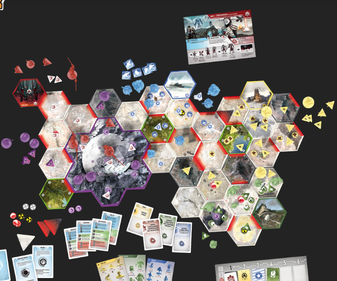

# Boas vindas ao repositório do Tsukuyumi-calculator

Este projeto foi desenvolvido por mim de forma fanmade para facilitar os calculos durantes as partidas do boardgame <strong>Tsukuyumi-Full-Moon-Down</strong> da  <strong>King Racoon Games</strong>.
site da King Racoon Games: https://kingracoon.com/en/studio/tsukuyumi/

Esta aplicação pode ser exibida no seu browser direto no endereço sem precisar de instalação. https://th-maia.github.io/tsukuyumi-calculator/

**A aplicação**
A aplicação se desenrola toda no front-end. um JSOn com os dados das unidades do jogo e um script.js para calcular e mostrar as facções na tela. 

# Orientações de INSTALAÇÃO DO PROJETO

  1. Caso queira baixar essa aplicação, Clone o repositório
  - Entre na pasta que deseja instalar no terminal.
  - Use o comando: `git clone git@github.com:th-maia/tsukuyumi-calculator.git`.
  - Entre na pasta do repositório que você acabou de clonar:
    - `cd tsukuyumi-calculator`

  2. Execute o arquivo `index.html` na pasta.

